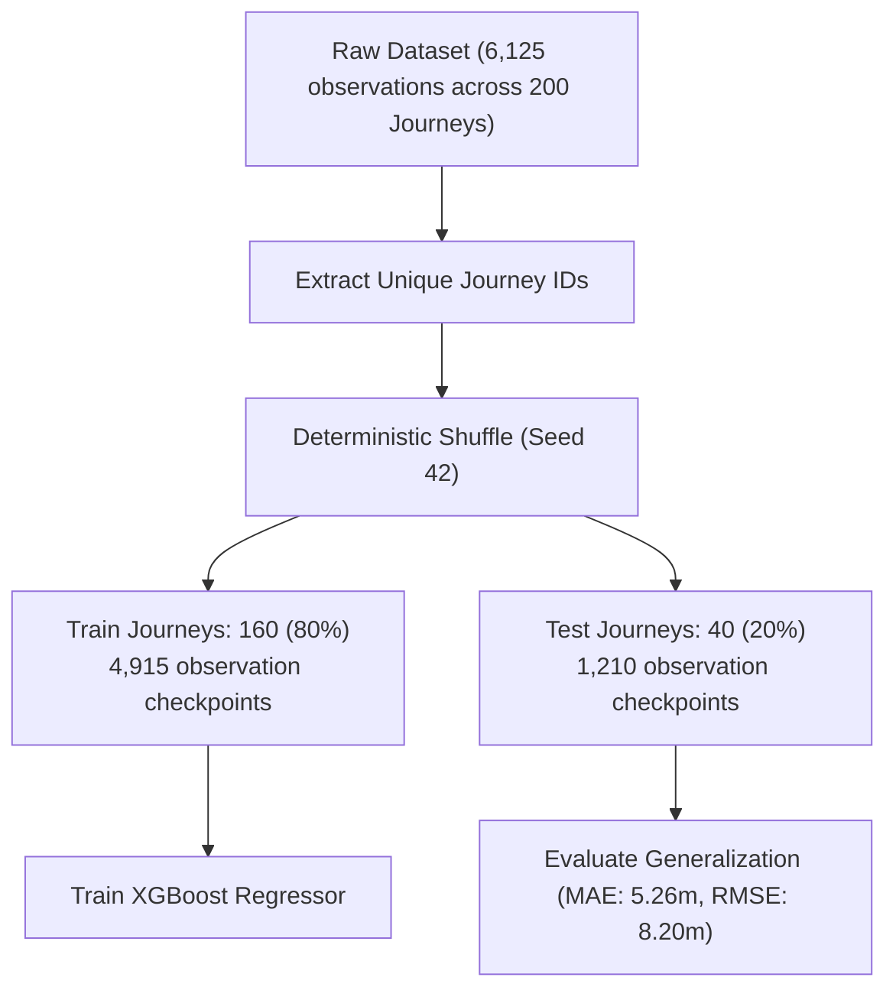

# Day 2 Phase 2: XGBoost ETA Prediction Model Report

> [!NOTE]
> **Synthetic Dataset & Model Disclaimer**:
> This model was trained on synthetic supervised train-running data generated by the Day 1 discrete-event simulator and Day 1 feature engineering pipeline. Timetables, simulated disruptions, and predictions serve MVP machine learning evaluation and **DO NOT** represent real historical Indian Railways operational logs.

---

## 1. Executive Summary

As part of **Day 2 Phase 2**, we implemented and trained the gradient-boosted regression model for Dynamic Train ETA Forecasting. The model predicts the target variable:

$$\text{minutes\_to\_next\_station} = \text{actual\_remaining\_minutes}$$

Using the 11 engineered PRD features, the model learns non-linear delay accumulation, speed damping under active caution orders, weather impacts, and schedule recovery dynamics across 3 primary Indian railway trunk corridors.

### Performance Highlights
- **Train Samples**: **4,915** across **160** journeys
- **Test Samples**: **1,210** across **40** journeys (strictly partitioned at journey level)
- **Mean Absolute Error (MAE)**: **5.262 minutes**
- **Root Mean Squared Error (RMSE)**: **8.196 minutes**
- **Coefficient of Determination ($R^2$)**: **0.9768**
- **Benchmark Comparison**: Reduces MAE by **81.5%** compared to the naive timetable heuristic ($\text{scheduled} + \text{delay} = 28.472\text{ min MAE}$).

---

## 2. Feature Specification & Schema

The model ingests 11 tabular features generated by [`backend.features.feature_builder.FeatureBuilder`](file:///d:/Projects/dynamic-eta-forecasting/backend/features/feature_builder.py):

| # | Feature Name | Category | Type | Description |
|---|---|---|---|---|
| **1** | `distance_to_go_km` | Static | `float` | Remaining track distance to upcoming target station |
| **2** | `scheduled_time_to_go_min` | Static | `float` | Timetable scheduled travel time from current position |
| **3** | `num_intermediate_halts` | Static | `int` | Number of scheduled stops between train and target station |
| **4** | `current_delay_min` | Dynamic | `float` | Accumulated train delay in minutes at current checkpoint |
| **5** | `delay_trend_3pt` | Dynamic | `float` | Delay change/slope across last 3 checkpoints |
| **6** | `active_speed_restriction_flag` | Dynamic | `int` | Binary flag ($1$ if TSR active on upcoming section, else $0$) |
| **7** | `congestion_score_downstream` | Dynamic | `float` | Traffic density / congestion score on upcoming segment $[0.0, 1.0]$ |
| **8** | `hist_avg_delay_this_section` | Historical | `float` | Section historical average delay in minutes (Day 1 synthetic default) |
| **9** | `hist_recovery_rate_section` | Historical | `float` | Section historical recovery pace min/100km (Day 1 synthetic default) |
| **10** | `weather_flag` | Contextual | `int` | Binary flag ($1$ if fog or heavy precipitation caution active) |
| **11** | `day_type` | Contextual | `int` | Operational schedule day classification: $0$=Weekday, $1$=Weekend, $2$=Holiday |

---

## 3. Train / Test Split Strategy: Journey-Level Partitioning

A critical architectural requirement in train delay modeling is preventing **time-series and spatial data leakage**. 

If observation checkpoints from the same train journey were randomly shuffled into both the training and test sets, the model would overfit on the specific delayed state of that exact trip rather than generalizing to unseen journeys.

### Partitioning Methodology
1. Extracted all **200 unique `journey_id`s** from [`data/processed/synthetic_train_eta_dataset.csv`](file:///d:/Projects/dynamic-eta-forecasting/data/processed/synthetic_train_eta_dataset.csv).
2. Performed a deterministic pseudo-random shuffle using `random_seed = 42`.
3. Assigned **80% of journeys (160 journeys, 4,915 observations)** to the Training Set.
4. Assigned **20% of journeys (40 journeys, 1,210 observations)** to the Holdout Test Set.
5. Guaranteed zero intersection between train and test journeys:
   $$\text{TrainJourneys} \cap \text{TestJourneys} = \emptyset$$



---

## 4. Model Architecture & Hyperparameters

The model uses XGBoost regression (`reg:squarederror`) optimized for tabular structured data:

| Hyperparameter | Value | Rationale |
|---|---|---|
| **Objective** | `reg:squarederror` | Optimizes mean squared error while tracking MAE metric |
| **Boosting Rounds ($N$)** | `150` | Balanced depth allowing convergence without overfitting |
| **Learning Rate ($\eta$)** | `0.05` | Conservative step size for smooth gradient descent |
| **Maximum Depth** | `5` | Captures multi-variable interaction (e.g. distance $\times$ speed restriction $\times$ delay) |
| **Subsample** | `0.85` | Row subsampling per boosting tree to prevent over-reliance on individual journeys |
| **Colsample by Tree** | `0.85` | Feature subsampling preventing single-feature dominance |
| **Min Child Weight** | `3` | Minimum sum of instance weight in a leaf node |
| **Gamma ($\gamma$)** | `0.1` | Minimum loss reduction required for further tree partition |
| **Random Seed** | `42` | Strictly deterministic reproducibility |

---

## 5. Evaluation Results & Benchmark Comparison

### Test Set Evaluation (Unseen Journeys)

| Metric | XGBoost Model | Naive Baseline ($\text{Sched} + \text{Delay}$) | Scheduled Timetable Only |
|---|:---:|:---:|:---:|
| **Mean Absolute Error (MAE)** | **5.262 min** | 28.472 min | 14.001 min |
| **Root Mean Squared Error (RMSE)** | **8.196 min** | 35.889 min | 20.274 min |
| **Coefficient of Determination ($R^2$)** | **0.9768** | 0.5481 | 0.8576 |
| **Error Reduction vs. Naive Baseline** | **-81.5%** | Benchmark ($0.0\%$) | -50.8% |

### Analysis of Predictions
1. **Dynamic Recovery Capture**: The naive heuristic assumes delays remain constant ($\Delta_{\text{current}}$ added directly to arrival). In practice, trains with high initial delays recover time over clear trunk sections due to schedule slack. The XGBoost model successfully captures this schedule absorption.
2. **Speed Restriction Modeling**: Under active temporary speed restrictions (`active_speed_restriction_flag = 1`), trains cannot sustain timetable speed. The model accurately increases remaining travel time to match physical speed restrictions ($30\text{--}50\text{ km/h}$).
3. **Physical Feasibility Guard**: Predictions are clamped to non-negative values ($\ge 0.0\text{ min}$), ensuring that near-station predictions never produce negative arrival intervals.

---

## 6. Feature Importance Summary

Feature importance was extracted across all 150 boosted trees using both **Gain** (relative contribution of each feature to the model) and **Weight** (number of splits across trees):

| Feature Name | Importance (Gain) | Split Count (Weight) | Primary Operational Role |
|---|:---:|:---:|---|
| **`distance_to_go_km`** | **62,477.77** | 682 | Primary kinematic determinant of travel time |
| **`scheduled_time_to_go_min`** | **34,957.09** | 563 | Base timetable foundation |
| **`congestion_score_downstream`** | **654.94** | 215 | Downstream traffic throttling factor |
| **`current_delay_min`** | **564.94** | 386 | Real-time accumulated running delay |
| **`weather_flag`** | **529.07** | 148 | Heavy rain / fog speed dampening |
| **`day_type`** | **439.42** | 276 | Operational day adjustments (weekday vs weekend/holiday) |
| **`delay_trend_3pt`** | **272.35** | 312 | Rate of delay accumulation / recovery trend |
| **`active_speed_restriction_flag`** | **79.48** | 89 | Track caution orders and speed capping |
| **`num_intermediate_halts`** | **0.00** | 0 | Unused in single-segment prediction (all direct hops) |
| **`hist_avg_delay_this_section`** | **0.00** | 0 | Static Day 1 default placeholder ($0.0$) |
| **`hist_recovery_rate_section`** | **0.00** | 0 | Static Day 1 default placeholder ($0.0$) |

---

## 7. Model Artifacts & Provenance

All model artifacts are versioned and stored under [`data/models/`](file:///d:/Projects/dynamic-eta-forecasting/data/models/):

- **Model Binary Artifact**: [`data/models/eta_xgboost_model.json`](file:///d:/Projects/dynamic-eta-forecasting/data/models/eta_xgboost_model.json)  
  Universal XGBoost JSON format compatible with cross-language runtime deployments (C++, Python, Go, Node.js).
- **Metadata Specification**: [`data/models/eta_xgboost_metadata.json`](file:///d:/Projects/dynamic-eta-forecasting/data/models/eta_xgboost_metadata.json)  
  Contains training timestamp, feature list, hyperparameter dictionary, test metrics, and synthetic data disclaimer.

---

## 8. Prediction Service (`ETAPredictor`) Usage

The reusable prediction service is implemented in [`backend.ml.predictor.ETAPredictor`](file:///d:/Projects/dynamic-eta-forecasting/backend/ml/predictor.py).

### Quickstart Example

```python
from backend.features.feature_builder import TrainFeatures
from backend.ml.predictor import ETAPredictor

# 1. Instantiate predictor (automatically loads model and metadata)
predictor = ETAPredictor()

# 2. Supply engineered TrainFeatures from Day 1 pipeline
features = TrainFeatures(
    train_number="12302",
    target_station_code="CNB",
    distance_to_go_km=145.0,
    scheduled_time_to_go_min=85.0,
    num_intermediate_halts=0,
    current_delay_min=12.0,
    delay_trend_3pt=1.0,
    active_speed_restriction_flag=0,
    congestion_score_downstream=0.0,
    hist_avg_delay_this_section=0.0,
    hist_recovery_rate_section=0.0,
    weather_flag=0,
    day_type=0,
)

# 3. Simple inference (returns minutes as float)
eta_minutes = predictor.predict(features)
print(f"Predicted minutes to next station: {eta_minutes}")
# Output: 82.3 min

# 4. Structured detailed inference
detail = predictor.predict_detailed(features)
print(f"Model version: {detail.model_version}, Prediction: {detail.minutes_to_next_station} min")
```

### CLI Retraining Command

To retrain the model at any time with custom hyperparameters or seed:
```bash
python -m backend.ml.train_model --data data/processed/synthetic_train_eta_dataset.csv --test-size 0.20 --seed 42
```
